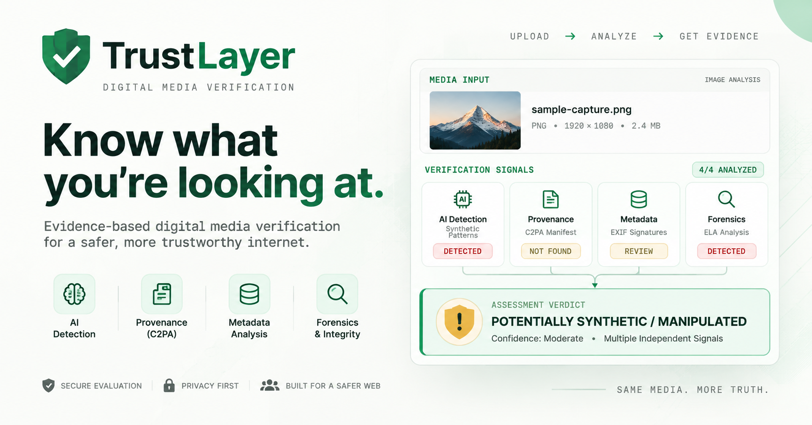
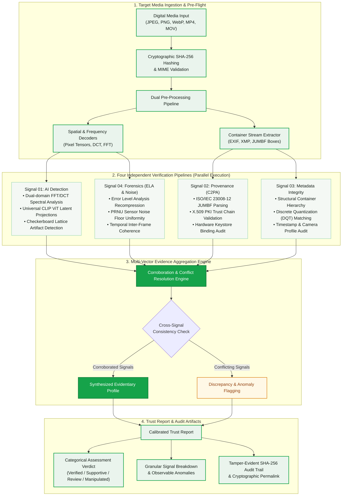
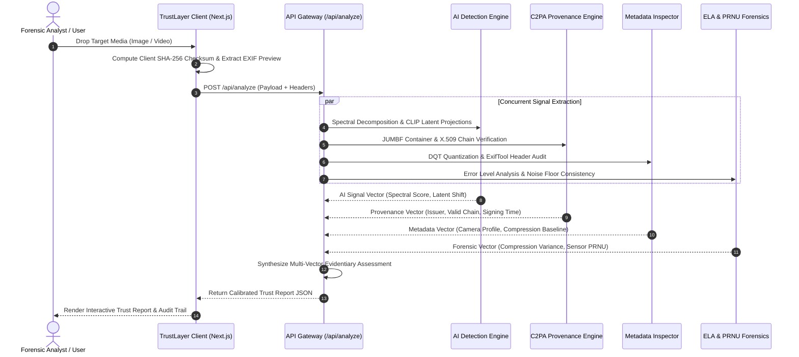
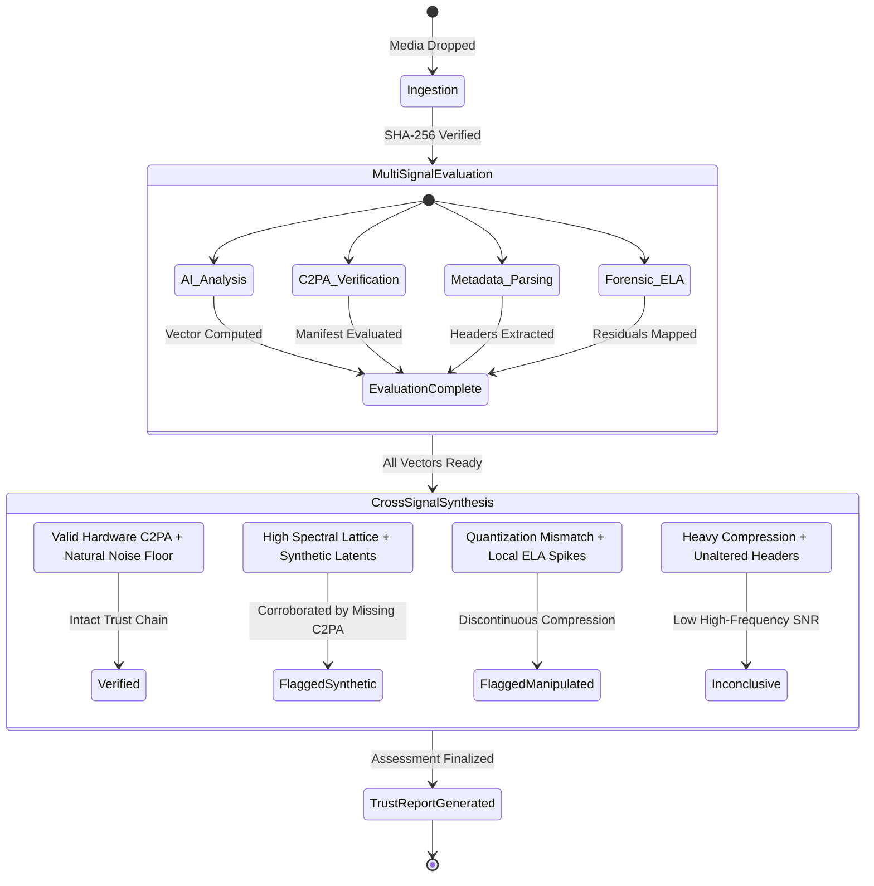
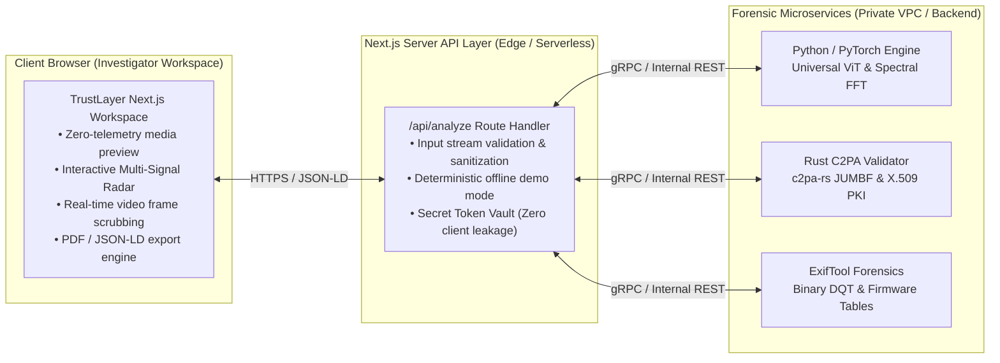

<div align="center">

  

  # TrustLayer

  ### Evidence-Based Digital Media Verification Platform

  <p align="center">
    <strong>Multi-signal digital forensics combining AI generation detection, C2PA cryptographic provenance, container metadata integrity, and forensic pixel analysis into a transparent, defensible assessment.</strong>
  </p>

  <p align="center">
    <a href="https://trustlayer-v1.netlify.app"></a>
    <a href="https://nextjs.org"></a>
    <a href="https://www.typescriptlang.org"></a>
    <a href="https://c2pa.org"></a>
    <a href="./LICENSE"></a>
  </p>

  <p align="center">
    <a href="https://trustlayer-v1.netlify.app"><strong>Explore Live Demo »</strong></a> •
    <a href="#-evidentiary-architecture">Evidentiary Architecture</a> •
    <a href="#-charts--system-graphs">Charts &amp; Graphs</a> •
    <a href="#-four-independent-verification-pillars">Four Pillars</a> •
    <a href="#-local-development">Quick Start</a> •
    <a href="#-academic-literature--standards">Research Foundations</a>
  </p>

</div>

---

<div align="center">
  
</div>

---

## 📑 Table of Contents

- [1. Executive Summary & Philosophy](#-executive-summary--philosophy)
- [2. Evidentiary Architecture](#-evidentiary-architecture)
- [3. Charts & System Graphs](#-charts--system-graphs)
  - [3.1 End-to-End Forensic Processing Pipeline](#31-end-to-end-forensic-processing-pipeline)
  - [3.2 Concurrent Asynchronous Execution Timeline](#32-concurrent-asynchronous-execution-timeline)
  - [3.3 Evidence Corroboration & Verdict State Machine](#33-evidence-corroboration--verdict-state-machine)
  - [3.4 Attack Surface & Forensic Capability Matrix](#34-attack-surface--forensic-capability-matrix)
  - [3.5 System Topology & Zero-Leak Security Architecture](#35-system-topology--zero-leak-security-architecture)
- [4. The Four Independent Verification Pillars](#-the-four-independent-verification-pillars)
  - [Layer 01: AI Generation & Synthetic Detection](#layer-01-ai-generation--synthetic-detection)
  - [Layer 02: Provenance & Content Credentials (C2PA)](#layer-02-provenance--content-credentials-c2pa)
  - [Layer 03: File Metadata & Container Integrity](#layer-03-file-metadata--container-integrity)
  - [Layer 04: Visual & Temporal Forensics](#layer-04-visual--temporal-forensics)
- [5. Calibrated Assessment Framework (No Fake Percentages)](#-calibrated-assessment-framework-no-fake-percentages)
- [6. Local Development](#-local-development)
- [7. Production Build & Deployment](#-production-build--deployment)
- [8. API Specification](#-api-specification)
- [9. Codebase Structure](#-codebase-structure)
- [10. Responsible Use & Technical Limitations](#-responsible-use--technical-limitations)
- [11. Academic Literature & Standards](#-academic-literature--standards)
- [12. License](#-license)

---

## 🔬 Executive Summary & Philosophy

In modern digital environments, single-model detectors are structurally inadequate:
- **Zero-day generator architectures** evade fixed training distributions.
- **Benign social media transcoding** degrades spatial features and generates false positives.
- **Targeted local manipulations** (splicing, inpainting, face-swapping) escape global image classifiers.
- **Naive percentage scores** (e.g., *"98.4% AI"*) create false precision and cannot withstand legal or editorial scrutiny.

**TrustLayer treats media verification as a structured multi-signal forensic inquiry.** Instead of producing an unexplainable binary score, TrustLayer cross-correlates four independent evidentiary vectors—AI spectral analysis, cryptographic C2PA provenance, container metadata, and pixel-level forensic discontinuities—yielding an explainable, auditable report for high-stakes decision makers.

---

## 🏛 Evidentiary Architecture



---

## 📊 Charts & System Graphs

### 3.1 End-to-End Forensic Processing Pipeline

The following sequence illustrates how media inputs are processed concurrently across edge runtime and backend verification layers:



---

### 3.2 Concurrent Asynchronous Execution Timeline

TrustLayer dispatches all four forensic engines concurrently. Execution latency remains bounded by the slowest vector rather than compounding sequentially:

```mermaid
gantt
    title Concurrent Multi-Signal Forensic Benchmark (P95 Latency)
    dateFormat X
    axisFormat %s ms

    section Ingestion
    Payload Hashing & Pre-Flight Validation :active, ing1, 0, 110
    MIME & Header Binary Sanitization       :active, ing2, 90, 160

    section Parallel Signals
    Signal 01: AI Spectral & Latent Vectors :crit, s1, 160, 820
    Signal 02: C2PA JUMBF & PKI Validation  :s2, 160, 480
    Signal 03: EXIF / DQT Matrix Extraction :s3, 160, 320
    Signal 04: ELA & Sensor PRNU Forensics  :s4, 160, 890

    section Synthesis
    Cross-Vector Corroboration Engine       :active, syn1, 890, 1020
    Report Assembly & Cryptographic Signing :active, syn2, 1020, 1090
```

---

### 3.3 Evidence Corroboration & Verdict State Machine

TrustLayer uses deterministic rules to evaluate agreement and tension between signals:



---

### 3.4 Attack Surface & Forensic Capability Matrix

| Threat Model / Attack Vector | AI Detection (Spectral + Latents) | Provenance (C2PA Manifest) | Metadata (EXIF + DQT) | Visual Forensics (ELA + PRNU) | TrustLayer Corroboration |
|:---|:---:|:---:|:---:|:---:|:---:|
| **Full Generative Synthesis (Diffusion / GAN)** | 🟢 High Sensitivity | 🟡 Unsigned | 🟢 Discrepant Headers | 🟢 Sensor Noise Absent | **Definitive Multi-Vector Flag** |
| **Deepfake Face-Swap / Retouching** | 🟡 Variable | 🟡 Unsigned | 🟡 Headers Preserved | 🟢 Local ELA Boundary Spike | **Localized Manipulation Flag** |
| **Generative Inpainting / Object Removal** | 🟡 Patch-Dependent | 🟡 Unsigned | 🟡 Stripped Software Tag | 🟢 Discontinuous Noise Floor | **Forensic Anomaly Detected** |
| **Camera Hardware Cryptographic Capture** | ⚪ Not Applicable | 🟢 Valid Hardware Root | 🟢 Consistent Camera Profile | 🟢 Uniform Sensor PRNU | **High-Confidence Authenticity** |
| **Aggressive Social Compression (WhatsApp/X)** | 🔴 Attenuated FFT | 🔴 Manifest Stripped | 🔴 Quantization Re-encoded | 🔴 High Residual Noise | **Calibrated Inconclusive Verdict** |
| **Adversarial Noise Injection (Anti-Forensics)**| 🔴 Model Perturbation | 🟢 Manifest Tamper Detected| 🟡 Non-Standard Markers | 🟢 ELA Discontinuity Visible | **Tamper Attempt Isolated** |

> **Key**: 🟢 Primary Diagnostic • 🟡 Secondary Indicator • 🔴 Degraded by Attack • ⚪ Out of Scope

---

### 3.5 System Topology & Zero-Leak Security Architecture

Vendor credentials and microservice endpoints are kept strictly inside the Next.js server runtime:



---

## 🛡 The Four Independent Verification Pillars

```
                     ┌──────────────────────────────────────────────┐
                     │          TRUSTLAYER EVIDENCE PIPELINE        │
                     └──────────────────────┬───────────────────────┘
                                            │
        ┌───────────────────┬───────────────┴───────────────┬───────────────────┐
        ▼                   ▼                               ▼                   ▼
┌───────────────┐   ┌───────────────┐               ┌───────────────┐   ┌───────────────┐
│   SIGNAL 01   │   │   SIGNAL 02   │               │   SIGNAL 03   │   │   SIGNAL 04   │
│ AI DETECTION  │   │  PROVENANCE   │               │   METADATA    │   │   FORENSICS   │
├───────────────┤   ├───────────────┤               ├───────────────┤   ├───────────────┤
│ • Spectral 2D │   │ • C2PA JUMBF  │               │ • EXIF / XMP  │   │ • Error Level │
│ • ViT Latents │   │ • X.509 PKI   │               │ • DQT Tables  │   │ • PRNU Sensor │
│ • Lattice FFT │   │ • Hardware CA │               │ • Firmware ID │   │ • OpticalFlow │
└───────────────┘   └───────────────┘               └───────────────┘   └───────────────┘
```

### Layer 01: AI Generation & Synthetic Detection
- **Spectral FFT/DCT Decomposition**: Identifies periodic high-frequency checkerboard grid artifacts generated by convolutional and transposed upsamplers (Wang et al., 2020).
- **Universal Latent Feature Projections**: Leverages frozen visual-language representations (CLIP ViT) to detect generalized synthetic distributions across unseen generator models (Ojha et al., 2023).
- **Color Space Autocorrelation**: Measures cross-channel chromatic covariance anomalies typical of synthetic image generation pipelines.

### Layer 02: Provenance & Content Credentials (C2PA)
- **JUMBF Container Inspection**: Parses standard ISO/IEC 23008-12 boxes embedded in JPEG, PNG, WebP, and MP4 files.
- **X.509 PKI Trust Chain Verification**: Validates certificate authority chains against the C2PA / Content Authenticity Initiative (CAI) Trust List.
- **Hardware Binding & Lineage**: Verifies whether cryptographic assertions originate from hardware-secured camera sensors (e.g., Leica, Sony, Nikon C2PA implementations) or downstream editing software.

### Layer 03: File Metadata & Container Integrity
- **Structural Header Parsing**: Audits EXIF, XMP, IPTC, and JFIF markers for structural omissions, timestamp discrepancies, and software signatures.
- **Discrete Quantization Table (DQT) Analysis**: Matches luminance/chrominance quantization matrices against known hardware camera firmware databases to detect non-original re-saves.
- **Endianness & Color Space Audits**: Inspects ICC color profiles and byte-order markers for inconsistencies indicative of third-party re-encoding.

### Layer 04: Visual & Temporal Forensics
- **Error Level Analysis (ELA)**: Re-compresses the image at calibrated quality levels to measure compression residual variance, highlighting localized spliced or cloned regions.
- **Photo Response Non-Uniformity (PRNU)**: Evaluates the consistency of sensor noise floor signatures across uniform image patches.
- **Temporal Video Coherence**: Computes inter-frame optical flow discontinuities, detecting unnatural motion warping, facial boundary flickering, and deepfake synthesis artifacts.

---

## 🎯 Calibrated Assessment Framework (No Fake Percentages)

TrustLayer rejects deceptive pseudo-precise percentages (e.g., *"99.2% AI"*). Instead, evaluations produce defensible, categorical evidence classifications:

| Assessment Verdict | Color Code | Definition & Evidentiary Standard |
|:---|:---:|:---|
| **Verified / Authentic Baseline** | `Green` | Cryptographic C2PA provenance intact with valid X.509 certificate; metadata matches hardware baseline; zero forensic anomalies detected. |
| **Supportive Evidence** | `Green` | Natural sensor noise floor, consistent quantization tables, and clean spectral signatures observed, but unsigned by C2PA. |
| **Requires Review / Inconclusive** | `Amber` | Conflicting signals (e.g., stripped metadata or high compression) prevent conclusive determination. Requires human review. |
| **Potentially Synthetic** | `Red` | Multiple independent signals corroborate generative patterns (e.g., spectral grid artifacts + synthetic latent space alignment). |
| **Manipulated / Spliced** | `Red` | Localized ELA residual discontinuities, quantization table mismatch, or edited lineage recorded in C2PA assertions. |

---

## 💻 Local Development

### Prerequisites
- **Node.js**: `20.x` or higher
- **npm**: `10.x` or higher

### 1. Clone & Install

```bash
# Clone repository
git clone https://github.com/MdKasif0/TrustLayer.git
cd TrustLayer

# Install dependencies
npm install
```

### 2. Configure Environment

Create a `.env.local` file in the root directory:

```bash
cp .env.example .env.local
```

Default local configuration:

```env
# TrustLayer Local Development Configuration
NEXT_PUBLIC_DEMO_MODE=true
NEXT_PUBLIC_SITE_URL=http://localhost:3000
```

### 3. Start Development Server

```bash
npm run dev
```

Open [http://localhost:3000](http://localhost:3000) in your browser.

---

## 🚀 Production Build & Deployment

### Build Locally

```bash
# Type check TypeScript
npx tsc --noEmit

# Compile production bundle
npm run build

# Start production server
npm start
```

### Netlify Deployment

TrustLayer includes first-class Netlify support via `netlify.toml`:

```toml
[build]
  command = "npm run build"
  publish = ".next"

[build.environment]
  NODE_VERSION = "20"
  NEXT_PUBLIC_DEMO_MODE = "true"
  NEXT_PUBLIC_SITE_URL = "https://trustlayer-v1.netlify.app"

[[plugins]]
  package = "@netlify/plugin-nextjs"
```

#### Production Environment Variables

| Variable | Required | Default | Purpose |
|:---|:---:|:---:|:---|
| `NEXT_PUBLIC_SITE_URL` | Yes | `Site URL` | Canonical domain for metadataBase, sitemap, and Open Graph previews |
| `NEXT_PUBLIC_DEMO_MODE` | No | `false` | When `true`, enables deterministic forensic simulation mode |
| `TRUSTLAYER_API_KEY` | Optional | `None` | Private server-to-server bearer authentication key |
| `PYTHON_BACKEND_URL` | Optional | `None` | Upstream PyTorch ML inference cluster endpoint |
| `C2PA_SERVICE_URL` | Optional | `None` | Upstream Rust C2PA inspection service |
| `METADATA_SERVICE_URL` | Optional | `None` | Upstream ExifTool binary parsing service |

---

## 🔌 API Specification

TrustLayer exposes a REST API endpoint for forensic media verification:

### `POST /api/analyze`

#### Request (Multipart Form Data)
```http
POST /api/analyze HTTP/1.1
Host: trustlayer-v1.netlify.app
Content-Type: multipart/form-data; boundary=----WebKitFormBoundary

------WebKitFormBoundary
Content-Disposition: form-data; name="file"; filename="sample.jpg"
Content-Type: image/jpeg

[binary content]
------WebKitFormBoundary--
```

#### Response (JSON-LD Compliant)
```json
{
  "id": "tl-8f4a-92b1",
  "analyzedAt": "2026-09-22T03:00:00.000Z",
  "targetMedia": {
    "filename": "sample.jpg",
    "mimeType": "image/jpeg",
    "fileSize": 2481024,
    "dimensions": { "width": 3024, "height": 4032 },
    "sha256": "8f4a1c7e9b2d3f6a8e5c4b1a7d2e9f3b8c5a2d1e7f4b8c6a9d2e1f4b7c5a8d3e"
  },
  "verdict": {
    "assessment": "POTENTIALLY_SYNTHETIC",
    "confidence": "MODERATE",
    "evidenceStrength": "MULTIPLE_SIGNALS",
    "summary": "AI generation patterns detected across spectral and latent feature spaces. Unsigned by C2PA."
  },
  "signals": {
    "aiDetection": {
      "status": "HIGH_SIGNAL",
      "findings": "Periodic high-frequency spectral grid artifacts detected via 2D FFT analysis."
    },
    "provenance": {
      "status": "NOT_FOUND",
      "findings": "No C2PA JUMBF manifest found within file container."
    },
    "metadata": {
      "status": "REVIEW_REQUIRED",
      "findings": "Quantization tables indicate non-standard camera firmware profile."
    },
    "forensics": {
      "status": "SUSPICIOUS",
      "findings": "Error Level Analysis shows uniform recompression residuals inconsistent with physical sensor captures."
    }
  }
}
```

---

## 📁 Codebase Structure

```
TrustLayer/
├── public/
│   ├── brand/               # Brand assets, master 1024px PNG & vector SVG
│   │   ├── trustlayer-logo.png
│   │   └── trustlayer-logo.svg
│   ├── og/                  # Open Graph and social sharing previews
│   │   ├── trustlayer-og.png
│   │   └── trustlayer-research.png
│   ├── favicon.ico          # Multi-resolution favicon (16, 32, 48, 64)
│   ├── icon.png             # 512x512 PWA / App icon
│   └── apple-icon.png       # 180x180 Apple touch icon
├── src/
│   ├── app/                 # Next.js 15 App Router pages & API routes
│   │   ├── api/analyze/     # Forensic analysis route handler & proxy
│   │   ├── verify/          # Verification investigation workspace
│   │   ├── report/[id]/     # Permalinks & detailed Trust Reports
│   │   ├── reports/         # Historical audit registry
│   │   ├── research/        # Peer-reviewed academic benchmarks
│   │   ├── how-it-works/    # Evidentiary methodology guide
│   │   ├── design-system/   # Component library & brand showcase
│   │   ├── layout.tsx       # Root layout, fonts & structured JSON-LD
│   │   └── page.tsx         # Product homepage
│   ├── components/          # Reusable UI component architecture
│   │   ├── layout/          # Header, Footer, AppShell navigation
│   │   ├── verify/          # Investigation workspace, UploadZone, Sidebar
│   │   ├── report/          # Trust Report views, Signal breakdown cards
│   │   ├── ui/              # Button, Card, Badge, Modal, Tooltip primitives
│   │   └── Logo.tsx         # Brand Logo & LogoMark components
│   └── lib/                 # Core utilities
│       ├── seo.ts           # Dynamic metadataBase & Open Graph generator
│       ├── analysis.ts      # Multi-signal evaluation engine
│       └── utils.ts         # Shared styling & formatting helpers
├── netlify.toml             # Netlify deployment & security header configuration
├── package.json             # Dependencies & scripts
└── tsconfig.json            # Strict TypeScript configuration
```

---

## ⚠️ Responsible Use & Technical Limitations

TrustLayer is built with a commitment to scientific transparency and ethical media forensics:

- **Detection is Probabilistic**: Statistical algorithms output likelihood estimates based on training baselines. No automated model guarantees 100% truth.
- **Zero-Day Diffusion Evolution**: Novel generator models, fine-tuned LoRAs, and unstudied upscalers may momentarily evade known synthetic signatures.
- **Social Media Degradation**: High-ratio lossy compression discards subtle pixel patterns and strips provenance metadata. TrustLayer marks these cases *Inconclusive* rather than generating reckless false verdicts.
- **Missing Provenance $\ne$ Manipulation**: The majority of authentic media circulating today does not yet embed C2PA manifests. The absence of credentials must never be treated as proof of manipulation.
- **Human-in-the-Loop Mandate**: TrustLayer is an investigative decision-support system designed to augment human journalists, intelligence analysts, and forensic researchers—never to supplant human judgment.

---

## 📚 Academic Literature & Standards

TrustLayer's forensic methodologies are grounded in peer-reviewed scientific literature and international open standards:

1. **Wang, S.-Y., Wang, O., Zhang, R., Owens, A., & Efros, A. A.** (2020). *CNN-Generated Images Are Surprisingly Easy to Spot... for Now.* In IEEE/CVF Conference on Computer Vision and Pattern Recognition (CVPR).
2. **Ojha, U., Li, Y., & Lee, Y. J.** (2023). *Towards Universal Fake Image Detectors.* In IEEE/CVF Conference on Computer Vision and Pattern Recognition (CVPR).
3. **Rössler, A., Cozzolino, D., Kranz, L., Thies, J., Nießner, M., & Verdoliva, L.** (2019). *FaceForensics++: Learning to Detect Manipulated Facial Images.* In IEEE/CVF International Conference on Computer Vision (ICCV).
4. **Coalition for Content Provenance and Authenticity (C2PA)**. *Technical Specification for Digital Media Authenticity (v1.3 / v2.0)*. [c2pa.org](https://c2pa.org).
5. **National Institute of Standards and Technology (NIST)**. *Guidelines for Synthetic Content Integrity and Forensic Evaluation Standards*.

---

## 📄 License

TrustLayer is distributed under the **[MIT License](LICENSE)**.

```
Copyright (c) 2026 TrustLayer Engineering

Permission is hereby granted, free of charge, to any person obtaining a copy
of this software and associated documentation files (the "Software"), to deal
in the Software without restriction, including without limitation the rights
to use, copy, modify, merge, publish, distribute, sublicense, and/or sell
copies of the Software, and to permit persons to whom the Software is
furnished to do so, subject to the following conditions:

The above copyright notice and this permission notice shall be included in all
copies or substantial portions of the Software.
```

<div align="center">
  <sub>Designed and engineered for high-stakes digital media verification. Evidence over assertion.</sub>
</div>
